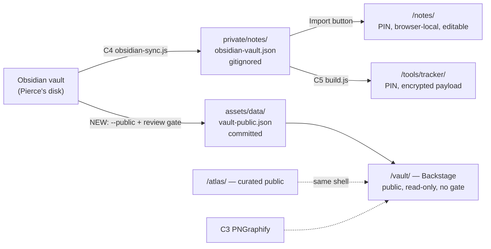

# BACKSTAGE — the vault, in public, with no gate

**Status: P0–P3 built 2026-09-08. P4 (publishing the personal vault) is waiting on Pierce.**
Drafted and executed the same day, for ROADMAP **R17**.

> **Where this stands.** `/vault/` is live, ungated, and reads a real published snapshot — but the snapshot it
> currently carries is the site's own `docs/` folder, every file of which was already public in this repo. That
> was deliberate: it exercises the whole pipe end to end and makes the visual judgeable **before** a single
> private note is committed. Pointing it at the personal vault is one command (`--vault "<vault>"`), and it
> should not be run until §7's questions are answered — see P4 in §6.
Decision on record: Pierce, 2026-09-08 — *"view the website back end Obsidian, no gate to get in, and a good visual."*
Asked which content, he picked **the whole personal vault, ungated** over the two narrower options.

---

## 0. The thing to understand before anything else

**"No gate" is not a PIN you delete. The vault is not on the website today.**

`/notes/` is not a viewer pointing at a vault on a server. It is browser-local storage: notes live in
IndexedDB in *one* browser, sealed with AES-256-GCM under a PBKDF2 key derived from the PIN, and the PIN
protects data that never left the machine. Delete the PIN prompt and a stranger opening `/notes/` sees an
empty page, because there was never anything on the server for them to see. Pierce's own vault sits on his
disk; the only way it reaches the browser today is the Import button.

So the real work is the opposite of removing a lock: **publishing a copy of the vault into the repo** and
building a reader for it. Every hard question in this plan follows from that one sentence — once the notes
are in a public GitHub repo they are public permanently, including in git history, including anything a
later scrub removes.

Second thing to know: **the repo's `.gitignore` denies everything by default** (`*`, then an allowlist),
because this folder doubles as Pierce's working vault. That is the single control that has kept the notes
off the internet for the life of the project. It is also, right now, silently eating a finished feature —
see §1.

---

## 1. Standing bug this plan must fix first

`atlas/index.html` — the knowledge atlas built 2026-09-07 (R16), wired into the nav, `sitemap.xml` and
`llms.txt` on every page — **is gitignored and has never deployed.**

```
$ git check-ignore -v atlas/index.html
.gitignore:7:*    atlas/index.html
```

`/assets/**` is allowlisted, so `atlas.css`, `atlas-data.js` and `atlas-ui.js` show up as untracked and
would commit fine; the page they exist for does not. Six pages currently link to a live 404. The allowlist
never got an `!/atlas/` pair, the way `!/island/` and `!/notes/` have. The same trap will swallow `/vault/`.

**Fix before anything else ships:** add `!/atlas/` + `!/atlas/index.html` to `.gitignore`, commit the four
atlas files together, confirm `/atlas/` loads on Pages. One line of fix, five minutes of verification.

---

## 2. Current connectors — what already exists

Everything below is built and working. The new surface should add exactly one connector, not replace these.

| # | Connector | Direction | Where it lives | Gate | Reaches the public web? |
|---|---|---|---|---|---|
| C1 | **Vault engine** — `PNVault`: `fromMarkdown` / `toMarkdown` / `importBundle`, wikilink resolution, backlinks | in-browser | `assets/js/vault.js` | PIN | No |
| C2 | **Notes UI** — reader, tag filter, editor, backlinks panel | in-browser | `assets/js/notes-ui.js`, `/notes/` | PIN | No |
| C3 | **Graph engine** — `PNGraphify.build()` (pure, unit-tested) + `mount()` (force-directed SVG) | in-browser | `assets/js/notes-graph.js` | none itself | Yes, via C6 |
| C4 | **Vault sync** — walks a real vault folder, calls C1's own parser, emits one `pn-vault-bundle` JSON | disk → file | `tools/obsidian-sync.js` | runs on Pierce's machine | No — output is gitignored |
| C5 | **Baked route** — `loadObsidianVault()` seals a bundle into the encrypted tracker payload | file → build | `tools/tracker/build.js` | tracker PIN | No (ciphertext only) |
| C6 | **Atlas** — 25 curated public notes, three-pane workspace, real link graph, timeline | static file | `assets/js/atlas-data.js`, `/atlas/` | **none** | Intended to — blocked by §1 |
| C7 | **Bottle porthole** — Easter-egg door reporting whether a vault exists *on this device* | in-browser | `assets/js/bottle.js` | key-presence check only | Yes (the door, not the notes) |

Two facts worth pulling out of that table:

- **C6 is the template.** The atlas already proves the exact shape this plan needs: a public JSON data file,
  an ungated three-pane Obsidian-style workspace, and a graph that is the *real* link graph of the content
  above it rather than a decoration. What C6 lacks is a real vault behind it — it is 25 notes typed by hand
  from `CONTENT.md`.
- **C4 is the missing half.** It already reads the real vault, correctly, using the site's own parser. Its
  output has simply never been allowed to leave the machine. Publishing is a new *mode* on C4, not a new
  script.

**Boundary that does not move:** the site is static, on GitHub Pages, with no server and no OAuth. CI cannot
pull the vault — the vault is on Pierce's disk, not behind a portable credential. Publishing is a snapshot,
produced by a command he runs, exactly like the Google Calendar pull (R9) and the tracker build.

---

## 3. Where this goes

**A new public surface at `/vault/`, titled "Backstage".** Not a change to `/notes/`.



Three reasons it is a separate page and not an ungated `/notes/`:

1. **`/notes/` is a writing surface; `/vault/` is a reading surface.** Editing, deleting and exporting only
   make sense against your own browser storage. A public reader has no business offering them, and merging
   the two means every future change to either has to reason about which mode it is in.
2. **The PIN on `/notes/` is still doing real work** — it guards the *editable* local copy, drafts included,
   on a laptop that gets opened in public. Nothing about publishing a snapshot argues for removing it.
3. **Two audiences, two front doors.** `/atlas/` answers "what has he learned"; `/vault/` answers "how does
   he actually work". Nav gets both; the bottle porthole (C7) finally gets a real destination to open onto,
   which is what the original Easter-egg idea wanted and could not have.

Naming: **Backstage**, at `/vault/`. "Backstage" says *this is the working material behind the finished
pages* without promising it is polished, and it does not collide with the atlas's "curated" framing.

---

## 4. The part that decides whether this is safe

Pierce's answer was "the whole vault", and this plan builds for that. But **"publish the whole vault" and
"publish it without reading it first" are different decisions**, and only the first one has been made.

One flag, plainly, then out of the way: a public repo is permanent and indexed. `CONTENT.md` §7 keeps a
"never on the site" list — client names and addresses, portfolio values and share counts, Screencastify
internal figures and vendor names — and `Portfolio Access.md` and the daily notes are exactly where those
live today. Publishing without a pass over the text would put on a career-facing site the one category of
thing the site has deliberately kept off it for its whole life. Third parties (clients, colleagues) also
appear in those notes without having chosen to.

So the plan keeps the scope Pierce chose and adds one gate that is **his**, not the reader's:

- **Default is publish.** Whole vault, as decided. No allowlist to maintain, no note quietly missing.
- **`publish: false` in frontmatter opts a note out** — one line, in Obsidian, where he is already standing.
  Same for a `#private` tag; a `nopublish/` folder excludes a whole tree.
- **The scrubber refuses on a hit, it does not silently redact.** Regexes for dollar amounts, street
  addresses, phone numbers, and the literal names on the `CONTENT.md` §7 list. A hit fails the run and
  prints `file:line`, so the fix happens in the vault rather than in a filter nobody remembers.
- **`--report` before the first publish is mandatory, and it is a human read.** Every note that would go
  public, listed with title, path and word count. Pierce reads that list top to bottom, once. After that,
  incremental runs report only what is new or changed.
- **Nothing lands until he says so.** The publish command writes the file; committing it is a separate,
  deliberate act.

If the first `--report` comes back and the vault is mostly daily working notes, the honest recommendation
may change to "publish `docs/` plus the notes you'd hand a colleague". That is a call to make *with the
report in hand*, not now.

---

## 5. The visual

Direction: **Slate command center** — Version 1 in `notes/visual-options/`, the dense, dark, keyboard-first
one. It is the closest of the three to real Obsidian, it inherits the site's existing dark palette instead
of fighting it, and it is the only one of the three that comfortably holds a file tree, a reader, a graph
and an inspector at once. This also finally closes **R10**, parked on exactly this choice since 2026-09-06.

Layout — the three-pane workspace shell, reused rather than rewritten. It was written for the atlas and lived in
`atlas.css` until R20 rebuilt `/atlas/` as a night sky; it now lives in `assets/css/workspace.css`, and `/vault/` is
its only caller:

```
┌──────────────────────────────────────────────────────────────────────┐
│  Backstage   ⌕ search…            [ Read ] [ Graph ] [ Timeline ]    │  ← C6's wbar
├──────────┬────────────────────────────────────────┬──────────────────┤
│ VAULT    │  # Weekly review                       │  LINKED          │
│ ▾ docs   │  ─────────────────────────             │  ← 4 backlinks   │
│   BLUE…  │  Rendered markdown: headings, lists,   │  → 6 outgoing    │
│   ROAD…  │  code, tables, callouts, and           │  ⚠ 1 unresolved  │
│ ▾ daily  │  [[wikilinks]] that actually resolve.  │                  │
│   2026…  │                                        │  TAGS  #systems  │
│ ▸ stocks │                                        │  local graph ▨   │
├──────────┴────────────────────────────────────────┴──────────────────┤
│  47 notes · 112 links · 2.4 per note · 3 orphans · 1 unresolved       │
└──────────────────────────────────────────────────────────────────────┘
```

What makes it read as Obsidian rather than as a docs site:

- **A real folder tree**, collapsible, mirroring vault paths. The atlas groups by domain, which is wrong for
  a vault — folders are how Pierce actually organises it.
- **The graph is the graph.** `PNGraphify` (C3), the same engine `/notes/` and `/atlas/` use, so every edge
  is a `[[wikilink]]` in the text above it. Tag nodes off on mount, toggleable back. Local-graph mode in the
  inspector: the selected note plus its immediate neighbourhood.
- **The inspector earns the third pane** — backlinks, outgoing links, unresolved links, tags. Unresolved
  links stay visible rather than hidden; on a public page they are honest, and they were R15's whole point.
- **⌘K command palette**, cursor keys to move, Enter to open, Esc to close. The atlas already binds ⌘K to
  search; this extends that convention instead of inventing a second one.
- **Deep links.** `/vault/#docs/BLUEPRINT.md` opens that note. Shareable, and the bottle porthole and the
  Experience page can point at specific notes.
- **Honest heavy and empty states.** A vault of a few hundred notes is not 25: the tree virtualises past
  ~200 rows, and the graph gets a "showing the largest connected component" control rather than a hairball.

Reused as-is: `site.css` tokens, `notes.css` (`.pg-*` graph styles), the atlas's `.workspace` grid, `nav.js`,
the skip link, focus rings (U1/U2/U3), `theme-color`, favicon.

**One genuinely new piece of code: a Markdown renderer.** There isn't one. `/notes/` and `/atlas/` escape the
body text and linkify `[[brackets]]` — fine for short curated notes, wrong for `BLUEPRINT.md`. It needs
headings, lists, fenced code, tables, blockquotes, inline emphasis and links, callouts and task checkboxes,
in ~200 lines of plain JS with **escape-first** ordering (escape, then structure — never the reverse), no
dependency, per standing rule 3. This is the piece most likely to be underestimated.

---

## 6. Moving plan

Five phases. Each one ends somewhere it is safe to stop.

| Phase | What | Status |
|---|---|---|
| **P0 — Unblock** | `.gitignore` allowlist for `/atlas/` (and `/vault/`); commit the atlas files; verify it loads | ✅ done — `git check-ignore` was hiding `atlas/index.html`; the page now loads with 25 notes, 30 links, 0 orphans |
| **P1 — Look before publishing** | `--report`: every note that *would* publish, with path and size, no text | ✅ built. Run against `docs/`, it caught 7 dollar amounts — all cleared-for-publication figures, so `money` was waived deliberately and the bundle records the waiver |
| **P2 — The publish pipe** | `--public`: `publish:false` / `#private` / `nopublish/` exclusions, refusing scrubber, `--prefix`, `--waive`, writes `assets/data/vault-public.js` | ✅ built, 26 tests in `tools/tracker/vault-publish.test.js` |
| **P3 — The reader** | `/vault/`, `vault-ui.js`, `vault.css`, `markdown.js`, folder tree, reader, graph, inspector, ⌘K, deep links | ✅ built and exercised in a browser; 24 renderer tests |
| **P4 — Publish the personal vault** | Point `--vault` at the real vault, read the report, commit the snapshot | ⏸ **waiting on Pierce** — §7 |
| **P5 — Keep it true** | `--public` in the local rebuild loop (rule 7); the bottle porthole (C7) repointed at `/vault/` | ⏸ after P4 |

**Deliberate change from the drafted plan.** P3 was to be built against a throwaway fixture and P4 was to wire
the nav. Instead the first *real* snapshot is the site's own `docs/` folder — 11 notes that were already public
in this repo — and the nav, sitemap and `llms.txt` are wired now. It gives the same "judge it before anything
private ships" property a fixture would have, but the page is honest and useful today rather than a mock, and
swapping the source is one flag. The irreversible step — committing personal notes — is still untaken.

**Found while building, both worth knowing:**

- **`/atlas/` had never deployed** (§1) — the reason P0 existed, confirmed by `git check-ignore`.
- **`PNGraphify` counted `[[links]]` written inside code spans.** A note *documenting* the link syntax was
  inventing edges, and inflating the unresolved count with the vault's own documentation about itself. Fixed in
  the shared engine with tests, so `/notes/` and `/atlas/` get it too: on the `docs/` snapshot it took the
  unresolved count from 6 to 0.

**Not built, on purpose:** tree virtualisation past ~200 rows and the graph's "largest connected component"
control (§5). Eleven notes need neither; both become real work the moment P4 lands a few hundred.

**The commit in P4 is the irreversible one.** Everything before it is reversible with `git checkout`. That is
the whole reason the phases are cut here: P3 builds the entire visual against fixtures, so the "good visual"
can be looked at, judged and rejected *before* a single real note is public.

Not in scope: editing from `/vault/` (read-only by design — writes belong in Obsidian), live sync (§2's
boundary), search indexing beyond client-side substring match, and any change to `/notes/`.

---

## 7. Open questions for Pierce

1. **Does the first `--report` change the answer?** If it lists 300 daily notes of three sentences each, is
   that still "publish the whole vault", or does it become "publish `docs/` plus what I'd hand a colleague"?
   Worth agreeing now that the report is allowed to change the decision.
2. **Third parties.** Client and colleague names appear in the vault. Publish, initial, or omit?
3. **Is the stepping stone actually the destination?** `/vault/` currently publishes the site's own `docs/`
   folder, and it reads well — "here is how this site is built, in the open" is a coherent page in its own
   right, and it carries no privacy question at all. Is P4 still what you want, or is this it?
4. **Nav pressure.** Seven top-level links is a lot. Does `/vault/` sit under a "Notes" grouping with
   `/notes/`, or stand on its own?

Source for all four: Claude, drafting this plan, 2026-09-08.
